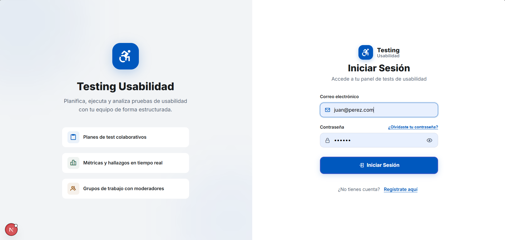
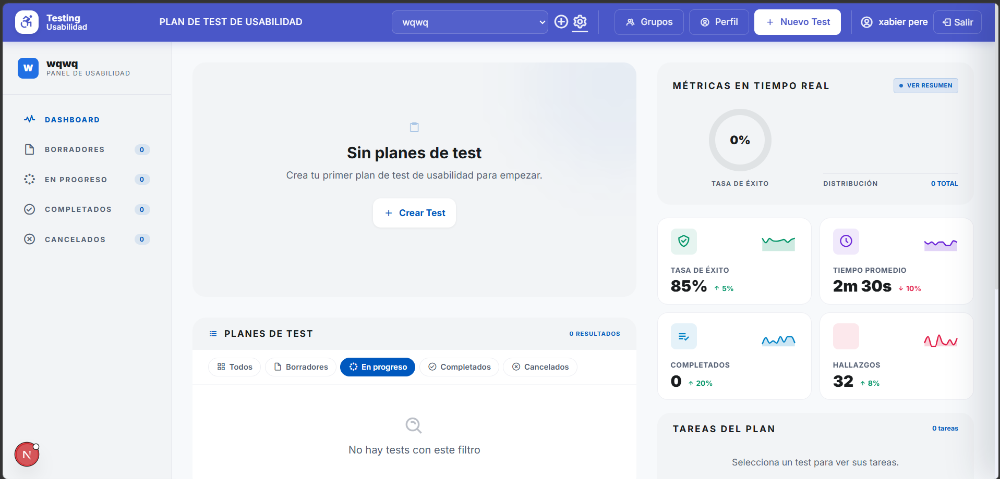
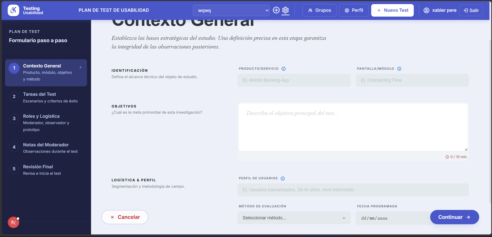
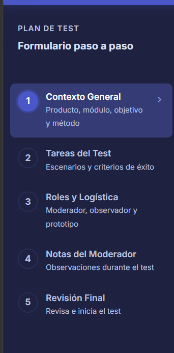
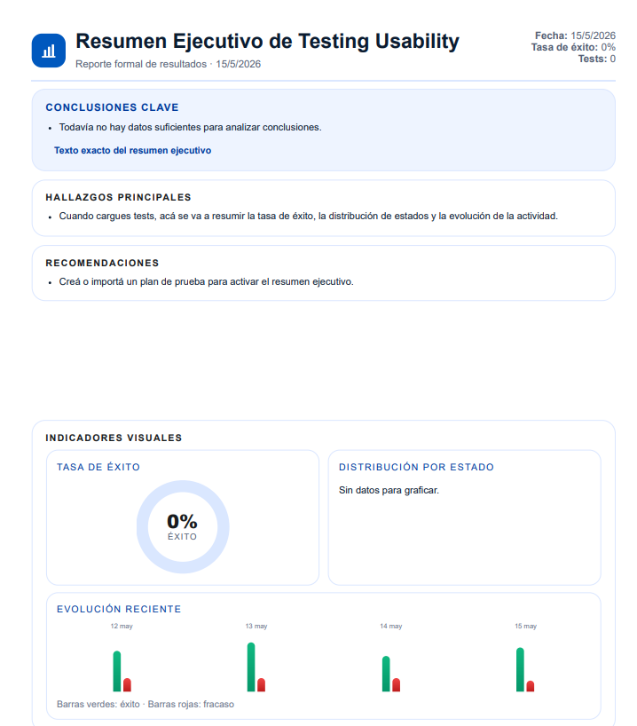

# Evaluación Heurística — Usability Test Dashboard 2.0

## 1. Introducción
Esta evaluación se basa en las **10 Heurísticas de Usabilidad de Jakob Nielsen** para identificar problemas de experiencia de usuario en el aplicativo institucional. El análisis abarca los módulos de Login, Dashboard, Formularios (Wizard), Navegación y Reportes.

---

## 2. Escala de Severidad
Para la clasificación de los problemas, se ha utilizado la siguiente escala:
*   **Crítico:** Impide la finalización de una tarea o causa gran frustración. Requiere corrección inmediata.
*   **Moderado:** Dificulta la tarea pero el usuario puede encontrar una alternativa. Debe corregirse pronto.
*   **Leve:** Problema estético o de pulido que no afecta directamente la funcionalidad principal.

---

## 3. Resumen de Hallazgos

| ID | Problema | Módulo | Severidad | Heurística Violada |
| :--- | :--- | :--- | :--- | :--- |
| 1 | Sobrecarga de información en el Dashboard | Dashboard | **Crítico** | #8: Estética y diseño minimalista |
| 2 | Falta de guardado automático en formularios | Formularios | **Crítico** | #5: Prevención de errores |
| 3 | Cambio de contexto confuso (Planning/Execution) | Navegación | **Crítico** | #4: Consistencia y estándares |
| 4 | Validaciones poco visibles en formularios largos | Formularios | **Moderado** | #9: Ayudar a reconocer errores |
| 5 | Ausencia de requisitos de contraseña | Login | **Moderado** | #5: Prevención de errores |
| 6 | Falta de ayuda contextual en métricas | Reportes | **Moderado** | #10: Ayuda y documentación |
| 7 | Reconocimiento vs Memoria en el Wizard | Formularios | **Moderado** | #6: Reconocimiento antes que recuerdo |
| 8 | Navegación de migas de pan (Breadcrumbs) limitada | Navegación | **Leve** | #3: Control y libertad del usuario |
| 9 | Indicador de filtros activos poco prominente | Dashboard | **Leve** | #1: Visibilidad del estado del sistema |
| 10 | Limitación en formatos de exportación | Reportes | **Leve** | #7: Flexibilidad y eficiencia de uso |

---
Login

Dashboard

Formularios

Navegación

Reportes

## 4. Detalle de los Problemas Identificados

### 4.1. Sobrecarga de Información (Dashboard)
*   **Descripción:** El dashboard principal muestra más de 10 gráficos y métricas simultáneamente sin una jerarquía visual clara. El usuario se siente abrumado al entrar.
*   **Heurística:** #8 Diseño estético y minimalista.
*   **Severidad:** **Crítico**.
*   **Recomendación:** Implementar un sistema de "progressive disclosure" o permitir al usuario personalizar qué métricas desea ver primero.

### 4.2. Falta de Guardado Automático (Wizard)
*   **Descripción:** El formulario de múltiples pasos solo persiste los datos al hacer clic en "Continuar". Si la sesión expira o se cierra la pestaña, el progreso del paso actual se pierde.
*   **Heurística:** #5 Prevención de errores.
*   **Severidad:** **Crítico**.
*   **Recomendación:** Implementar un debounced autosave que guarde los datos en el `localStorage` o base de datos mientras el usuario escribe.

### 4.3. Confusión en Modos de Trabajo (Navegación)
*   **Descripción:** Al alternar entre "Plan de Test" y "Workbench de Ejecución", la barra lateral y los controles cambian drásticamente sin una transición clara, desorientando al usuario sobre su ubicación actual.
*   **Heurística:** #4 Consistencia y estándares.
*   **Severidad:** **Crítico**.
*   **Recomendación:** Usar indicadores visuales de color o estados más claros para diferenciar los modos, y mantener elementos comunes en la misma posición.

### 4.4. Visibilidad de Errores (Formularios)
*   **Descripción:** Los mensajes de error del sistema (guardas) aparecen en un banner superior. En pantallas con scroll, el usuario no ve el error y piensa que el botón "Continuar" no funciona.
*   **Heurística:** #9 Ayuda para reconocer, diagnosticar y recuperarse de errores.
*   **Severidad:** **Moderado**.
*   **Recomendación:** Utilizar validaciones en línea (inline validation) y hacer scroll automático al primer campo con error.

### 4.5. Requisitos de Seguridad (Login)
*   **Descripción:** El formulario de registro no indica los requisitos de complejidad de la contraseña (números, símbolos, etc.) hasta después de fallar el envío.
*   **Heurística:** #5 Prevención de errores.
*   **Severidad:** **Moderado**.
*   **Recomendación:** Mostrar una lista de verificación de requisitos que se marque dinámicamente mientras el usuario escribe.

### 4.6. Ayuda en Reportes (Reportes)
*   **Descripción:** Gráficos como el "Radar Chart" o la "Tasa de Éxito" no explican cómo se calculan o qué implican para la toma de decisiones.
*   **Heurística:** #10 Ayuda y documentación.
*   **Severidad:** **Moderado**.
*   **Recomendación:** Incluir tooltips informativos o un ícono de "info" en cada sección de reporte.

### 4.7. Memoria de Trabajo (Wizard)
*   **Descripción:** En el paso de "Tareas del Test", el usuario no puede ver los objetivos definidos en el paso anterior sin retroceder, obligándolo a recordar información técnica.
*   **Heurística:** #6 Reconocimiento en lugar de recuerdo.
*   **Severidad:** **Moderado**.
*   **Recomendación:** Mostrar un resumen lateral persistente con los datos clave de los pasos anteriores.

### 4.8. Control en Breadcrumbs (Navegación)
*   **Descripción:** Las migas de pan solo permiten volver al Dashboard, pero no navegar entre los pasos del Wizard de forma directa.
*   **Heurística:** #3 Control y libertad del usuario.
*   **Severidad:** **Leve**.
*   **Recomendación:** Hacer que cada paso del proceso sea clicable en el rastro de migas de pan.

### 4.9. Feedback de Filtros (Dashboard)
*   **Descripción:** Al aplicar filtros de estado, el sistema no muestra un mensaje claro de "Mostrando X resultados para [Estado]".
*   **Heurística:** #1 Visibilidad del estado del sistema.
*   **Severidad:** **Leve**.
*   **Recomendación:** Añadir un contador dinámico cerca del título de la sección de listado.

### 4.10. Flexibilidad de Exportación (Reportes)
*   **Descripción:** El sistema solo permite exportar a PDF (formato de lectura). No hay opción de CSV para investigadores que necesitan procesar los datos en otras herramientas.
*   **Heurística:** #7 Flexibilidad y eficiencia de uso.
*   **Severidad:** **Leve**.
*   **Recomendación:** Añadir un botón de "Exportar a CSV/Excel".

---

## 5. Conclusión
El sistema presenta una base funcional sólida, pero su principal debilidad radica en la **gestión de la carga cognitiva** y la **prevención de pérdida de datos** en procesos largos. La corrección de los problemas críticos identificados mejorará significativamente la adopción del sistema por parte de los UX Researchers. 
