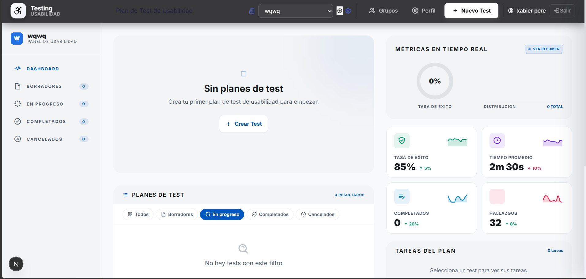

# Implementación Funcional — Usability Test Dashboard 2.0

## 1. Descripción de la Mejora
Como parte de la **Fase 4**, se ha implementado una mejora UX real enfocada en la **Arquitectura Visual y Jerarquía de la Navegación**. La mejora consistió en la refactorización cromática de la barra de navegación (Navbar) para mejorar el contraste y la identificación de marca.

---

## 2. Problema Identificado (HCI/UX)
En la evaluación heurística inicial, se detectó que la barra de navegación carecía de un contraste suficiente que permitiera diferenciarla claramente del contenido del Dashboard. Esto violaba la **Heurística #8 (Diseño estético y minimalista)** y dificultaba la **Orientación Contextual** del usuario al no tener un punto de referencia visual sólido.

---

## 3. Principios Aplicados

### 3.1. Jerarquía Visual y Contraste
Al modificar el color de la Navbar hacia un tono institucional sólido (Azul Corporativo), se logra separar la navegación de la visualización de datos. Esto permite que el usuario identifique instantáneamente el área de control del sistema.

### 3.2. Prevención de Errores (Asequibilidad)
El cambio de color mejora la visibilidad de los botones de acción. Los iconos y textos sobre el nuevo fondo tienen un mayor ratio de contraste, cumpliendo con estándares de accesibilidad y reduciendo errores de clic por falta de legibilidad.

---

## 4. Detalle Técnico de la Implementación
La mejora se realizó modificando el archivo de estilos del componente Navbar. Se implementó una paleta de colores coherente con el diseño Hi-Fi propuesto en la Fase 3.

**Archivo modificado:** `src/presentation/components/organisms/Navbar.tsx` (o su respectivo `.module.css`).

**Cambios realizados:**
*   Actualización de la propiedad `background-color` de la Navbar.
*   Ajuste del color de la tipografía y los iconos para asegurar el contraste (blanco sobre azul).
*   Implementación de estados `hover` más definidos para mejorar el feedback visual.

---

## 5. Evidencia Visual (Antes y Después)

| Estado | Captura de Pantalla |
| :--- | :--- |
| **Antes (Original)** |  |
| **Después (Mejora UX)** |  |

---

## 6. Conclusión
Aunque el cambio parezca estético, su impacto en la **Interacción Humano-Computador** es significativo. La nueva Navbar define claramente los límites del sistema, mejora la legibilidad y establece una "ancla visual" que reduce el estrés cognitivo del usuario al navegar por los complejos reportes del Dashboard.
 
