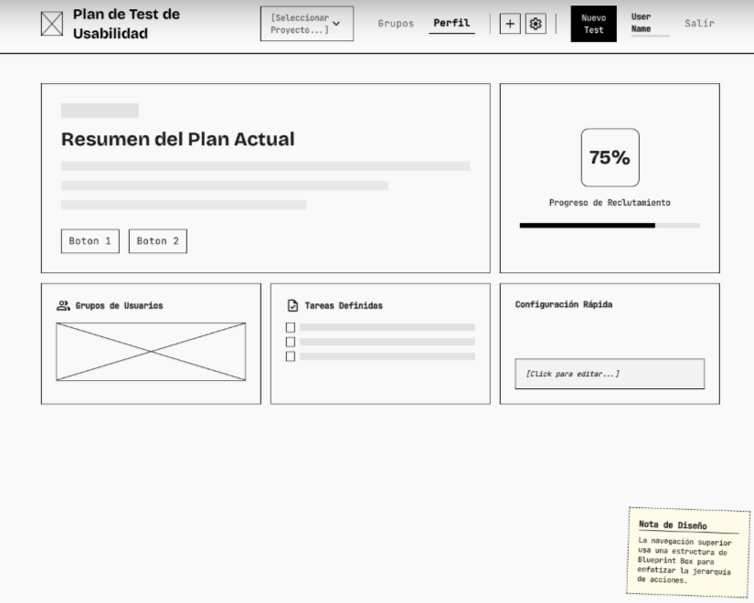
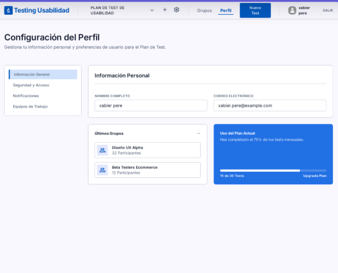
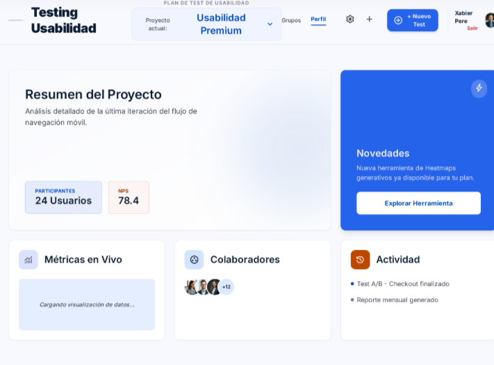

# Rediseño UX — Usability Test Dashboard 2.0

## 1. Selección de Pantalla Crítica

Para el proceso de rediseño UX se ha seleccionado la **Barra de Navegación (Navbar)** y el **Dashboard Principal** del sistema “Usability Test Dashboard 2.0”.

La decisión se tomó debido a que esta sección representa el punto de interacción más frecuente entre el usuario y la plataforma. Durante la evaluación heurística se detectaron múltiples problemas relacionados con:

- Sobrecarga visual
- Exceso de opciones visibles
- Falta de jerarquía visual
- Escasa diferenciación entre acciones primarias y secundarias
- Navegación poco intuitiva
- Baja orientación contextual
- Dificultad para reconocer funciones prioritarias

La Navbar actual concentra demasiados elementos en un solo nivel visual, generando:
- Incremento de carga cognitiva
- Mayor tiempo de reconocimiento
- Distracción visual
- Pérdida de enfoque en las tareas principales

El objetivo principal del rediseño es transformar la experiencia de navegación en una interacción:
- Más limpia
- Más moderna
- Más intuitiva
- Más accesible
- Más eficiente

---

# 2. Objetivos del Rediseño UX

El rediseño busca cumplir los siguientes objetivos:

## Objetivos Generales

- Mejorar la experiencia de usuario
- Reducir la complejidad visual
- Optimizar la navegación
- Mejorar la accesibilidad
- Facilitar el reconocimiento de funciones
- Incrementar la eficiencia operativa

## Objetivos Específicos

- Destacar visualmente la acción principal "Nuevo Test"
- Reducir la saturación de botones
- Organizar mejor la información
- Crear una navegación contextual clara
- Mejorar la percepción estética del sistema
- Reducir errores de interacción
- Implementar una interfaz moderna tipo SaaS Dashboard

---

# 3. Aplicación de Principios UX y HCI

## 3.1. Leyes de Gestalt

Las Leyes de Gestalt permiten mejorar la percepción visual y reducir el esfuerzo cognitivo del usuario.

### Ley de Proximidad
Los elementos relacionados se agruparán visualmente para que el usuario identifique rápidamente bloques funcionales.

### Aplicación:
- Grupo de navegación principal
- Grupo de configuración
- Grupo de perfil y sesión
- Grupo de acciones rápidas

Esto ayuda al cerebro a interpretar la interfaz como estructuras organizadas.

---

### Ley de Semejanza

Los componentes que pertenecen a la misma categoría compartirán:
- Tamaño
- Color
- Iconografía
- Espaciado
- Estilo visual

### Aplicación:
- Botones secundarios homogéneos
- Iconos lineales minimalistas
- Inputs y dropdowns consistentes

Esto mejora el reconocimiento inmediato de funcionalidades similares.

---

### Ley de Continuidad

La navegación seguirá un flujo natural de lectura:
- Izquierda → Branding
- Centro → Navegación principal
- Derecha → Usuario y sesión

Esto evita interrupciones visuales y mejora la exploración.

---

### Ley de Figura y Fondo

Se incrementará el contraste entre:
- Navbar y contenido
- CTA principal y botones secundarios
- Información prioritaria y secundaria

Esto permite destacar acciones críticas.

---

### Ley de Simplicidad

Se reducirá el ruido visual:
- Menos bordes innecesarios
- Menos colores simultáneos
- Menos elementos visibles al mismo tiempo

El objetivo es lograr una interfaz limpia y fácil de comprender.

---

# 4. Jerarquía Visual

La jerarquía visual será rediseñada para dirigir la atención del usuario hacia las tareas más importantes.

## Acción Principal

### Botón "Nuevo Test"
Será el componente más visible del navbar.

### Características:
- Color sólido institucional
- Mayor tamaño
- Elevación suave (shadow)
- Espaciado superior
- Iconografía clara

El usuario debe reconocer instantáneamente cuál es la acción principal del sistema.

---

## Acciones Secundarias

Los elementos secundarios tendrán:
- Menor peso visual
- Estilo outline o ghost
- Menor contraste
- Tipografía ligera

Esto evita competencia visual con el CTA principal.

---

## Tipografía

Se aplicará una escala tipográfica moderna:

| Elemento | Tamaño | Peso |
|---|---|---|
| Título principal | Grande | Bold |
| Navegación | Media | SemiBold |
| Información secundaria | Pequeña | Regular |

---

# 5. Arquitectura de Información

La arquitectura de información será reorganizada para mejorar:
- Descubrimiento
- Navegación
- Escalabilidad
- Comprensión del sistema

## Nueva Organización

### Nivel 1 — Navegación Visible
Elementos prioritarios visibles permanentemente:
- Logo
- Selector Workspace/Test
- Nuevo Test
- Perfil

---

### Nivel 2 — Menús Desplegables
Opciones menos utilizadas:
- Configuración avanzada
- Historial
- Reportes
- Administración de grupos

---

### Beneficios

- Menor saturación visual
- Navegación más limpia
- Mejor escalabilidad futura
- Reducción de ruido cognitivo

---

# 6. Navegación Contextual

Se implementarán mecanismos que permitan al usuario comprender:
- Dónde está
- Qué está haciendo
- Cómo regresar

## Breadcrumbs

Se incorporarán breadcrumbs dinámicos.

### Ejemplo:
Dashboard / Tests / Nuevo Test / Configuración

### Beneficios:
- Orientación espacial
- Navegación rápida
- Menor desorientación
- Mejor experiencia en workflows largos

---

## Estados Activos

La navegación mostrará:
- Sección activa resaltada
- Hover states
- Indicadores de progreso

Esto mejora la percepción de control.

---

# 7. Prevención de Errores

La interfaz será diseñada para minimizar errores humanos.

## Validaciones Inteligentes

- Campos obligatorios destacados
- Inputs inválidos detectados en tiempo real
- Mensajes claros y comprensibles

---

## Confirmaciones

Acciones críticas requerirán confirmación:
- Eliminar test
- Cerrar sesión
- Cancelar procesos

---

## Feedback Visual

Se implementarán:
- Toast notifications
- Estados de carga
- Badges de estado
- Indicadores de éxito/error

---

# 8. Diseño Emocional

El diseño emocional busca generar:
- Confianza
- Modernidad
- Profesionalismo
- Satisfacción visual

## Estilo Visual Aplicado

### Glassmorphism
- Transparencias suaves
- Fondos difuminados
- Capas modernas

### Bento Grid
- Distribución modular
- Mejor organización visual
- Sensación premium

### Microinteracciones
- Hover animations
- Smooth transitions
- Feedback instantáneo

---

# 9. Accesibilidad

El rediseño considera principios básicos de accesibilidad:

- Contraste adecuado
- Tipografía legible
- Tamaños de click amplios
- Navegación intuitiva
- Íconos reconocibles
- Responsive Design

---

# 10. Wireframes

# 10.1. Lo-Fi (Baja Fidelidad)

## Objetivo
Definir únicamente:
- Estructura
- Distribución
- Flujo de navegación
- Zonificación

Sin distracciones visuales.

---

## Características

- Escala de grises
- Cajas simples
- Boceto estructural
- Sin branding
- Sin efectos visuales

---

## Elementos Incluidos

- Logo placeholder
- Menú horizontal
- Dropdown central
- CTA principal
- Perfil usuario

---

## Beneficios

Permite:
- Validar estructura
- Detectar problemas tempranos
- Ajustar navegación rápidamente

---

### Wireframe Lo-Fi

---

# 10.2. Mid-Fi (Media Fidelidad)

## Objetivo
Definir:
- Tamaños
- Espaciados
- Interacciones básicas
- Arquitectura visual

---

## Características

- Componentes más definidos
- Escala de grises avanzada
- Jerarquía visual parcial
- Simulación de navegación

---

## Elementos Incluidos

- Botones estructurados
- Dropdowns funcionales
- Estados hover
- Menú organizado
- Espaciados consistentes

---

## Beneficios

Permite:
- Evaluar usabilidad
- Validar navegación
- Simular interacción real

---

### Wireframe Mid-Fi
 

---

# 10.3. Hi-Fi (Alta Fidelidad)

## Objetivo
Representar el producto final casi listo para producción.

---

## Características

- Colores finales
- Tipografía definitiva
- Branding institucional
- Microanimaciones
- Iconografía moderna
- Glassmorphism
- Sombras y profundidad

---

## Estilo Visual

Inspiración:
- Figma
- Linear
- Notion
- Dashboards SaaS modernos

---

## Componentes Finales

- Navbar moderna
- CTA destacado
- Avatar usuario
- Dropdown premium
- Iconos minimalistas
- Breadcrumbs

---

## Beneficios

Permite:
- Validar experiencia final
- Mostrar visión completa
- Simular entorno real

---

### Wireframe Hi-Fi

---

# 11. Impacto Esperado del Rediseño

Con el nuevo diseño se espera:

| Métrica | Mejora Esperada |
|---|---|
| Tiempo de reconocimiento | -40% |
| Carga cognitiva | -35% |
| Errores de navegación | -30% |
| Satisfacción visual | +50% |
| Claridad de acciones | +45% |

---

# 12. Conclusión del Rediseño

El rediseño UX transforma una interfaz saturada y poco organizada en una experiencia:
- Moderna
- Clara
- Escalable
- Minimalista
- Centrada en el usuario

La nueva Navbar mejora significativamente:
- La navegación
- La orientación contextual
- La eficiencia operativa
- La percepción visual del sistema

Al reducir el ruido visual y destacar las acciones prioritarias, el usuario puede enfocarse en lo realmente importante:
## Los datos, los tests y la toma de decisiones.

---

# 13. Tecnologías y Herramientas Utilizadas

- Figma
- GitHub
- UX Heuristics
- Scrum
- IA Generativa
- Arquitectura UX
- Diseño Centrado en el Usuario

---
 